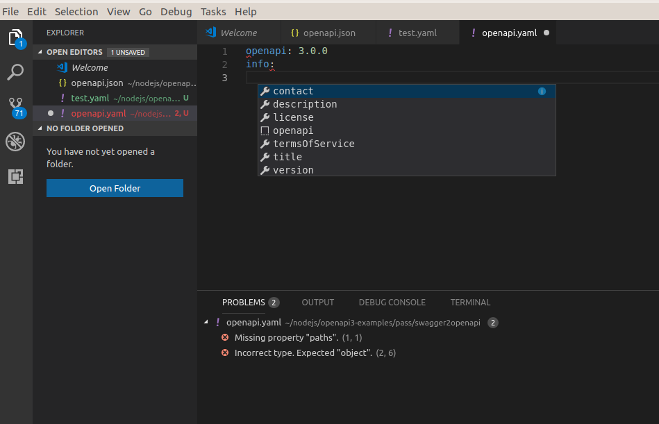

# openapi-lint README

This extension can be used to validate and [lint](https://en.wikipedia.org/wiki/Lint_(software)) OpenAPI 3.0.x documents. It provides two Visual Studio Code commands:

* OpenAPI Validate - which fully validates your OpenAPI document against the [specification](https://github.com/OAI/OpenAPI-Specification/blob/master/versions/3.0.1.md)
* OpenAPI Lint - which additionally applies a lightly-opinionated set of best-practices

The validator enforces restrictions which cannot be expressed by the JSON Schema which drives the intellisense features, so it will pick up on more errors.

The best documentation currently for the linter rules is that of [Speccy](http://speccy.io/rules/), which shares code with this project. The linter [rules format](https://mermade.github.io/oas-kit/linter-rules.html) is also documented.

## Features

* Validation using [oas-validator](https://github.com/Mermade/oas-kit/tree/master/packages/oas-validator) from [OAS-Kit](https://mermade.github.io/oas-kit/)
* Linting using [oas-linter](https://github.com/Mermade/oas-kit/tree/master/packages/oas-validator) also from OAS-Kit
* v3 intellisense for files named `openapi.json`, `openapi.yaml`, `openapi.yml`
* v2 intellisense for files named `swagger.json`, `swagger.yaml`, `swagger.yml`
* Conversion between JSON and YAML
* Snippets (minimal valid openapi/swagger JSON and YAML documents)

## Coming soon

* Conversion from OAS (Swagger) 2.0 to OAS 3.0.0
* Validation and linting with optional resolution
* Snippets (minimal lintable JSON and YAML documents)

## Screenshots

## Requirements

The extension should work as-is

## Extension Settings

No configuration is currently possible or needed.

## Known Issues

* Messages need better formatting
* Jump-to-error functionality not implemented yet
* No way to override/amend linter rules yet

## Credits

* Icon based upon [Icons8](http://icons8.com/)

## Release Notes

See also the CHANGELOG.md

### 0.x.x

Initial alpha releases of openapi-lint
